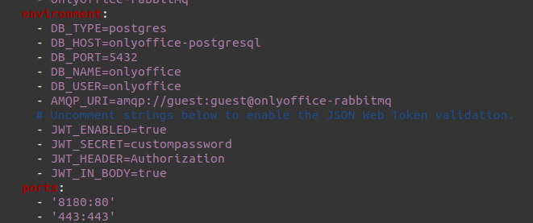

# Simple OnlyOffice Installation with Docker
This simple guide will guide developers on the installation process of OnlyOffice using Docker.

## Getting Started

### Requirements

* ILIAS 6.x / 7.x
* docker
* docker-compose

### Install OnlyOffice Docs
OnlyOffice Docs is used to edit documents from a separate server. First, we need to set OnlyOffice Docs up on a separate docker installation and 
later connect it to the plugin.

Clone the repository into a folder of your choice and start it up. Instructions were taken from [here](https://helpcenter.onlyoffice.com/installation/docs-community-docker-compose.aspx).
```bash
git clone https://github.com/ONLYOFFICE/Docker-DocumentServer
cd Docker-DocumentServer
sudo docker-compose up
```

> You may get an error saying "address already in use". This is likely because your host machine already utilises the port 80 for ilias.
> To fix this, edit the ports in docker-compose.yml of OnlyOffice Docs to 8180:80.
>
>

OnlyOffice Docs is now running on your docker server. Let's make it more secure in the next step.

#### Security Configuration for OnlyOffice Docs
Open your OnlyOffice Docs' docker-compose.yml file.

In the environment section, uncomment all variables starting with "JWT". Set a safer password for the JWT_SECRET variable.



### Install Ilias & the OnlyOffice-Plugin
Clone the OnlyOffice repository and run it:
```bash
mkdir -p Customizing/global/plugins/Services/Repository/RepositoryObject
cd Customizing/global/plugins/Services/Repository/RepositoryObject
git clone https://git.fluxlabs.ch/fluxlabs/ilias/plugins/RepositoryObjects/OnlyOffice.git OnlyOffice
sudo docker-compose up
```

Once the docker is running, we need to clone the plugin first to get rid of all errors. From the previous steps, a new folder should appear called "ilias-www". Now do the following:

```bash
cd ilias-www/
sudo mkdir -p Customizing/global/plugins/Services/Repository/RepositoryObject
cd Customizing/global/plugins/Services/Repository/RepositoryObject
sudo git clone https://git.fluxlabs.ch/fluxlabs/ilias/plugins/RepositoryObjects/OnlyOffice.git OnlyOffice
```
> You may want to change the permissions of the "ilias-www" folder using chmod if you are planning on editing the files inside.

Now you can install, update & activate the OnlyOffice plugin in your ILIAS installation.


#### Configure ILIAS
Start at your ILIAS root directory.
Open .htaccess file. Add the following line:
``` code
Header set Access-Control-Allow-Origin "https://onlyoffic_docs.example"
```
Where "onlyoffice_docs.example" is the name of the server where OnlyOffice Docs is installed.
If you did not set up https, use "http://" instead.

Next you must navigate to the plugin's configuration form.
Enter the root URL of your OnlyOffice Docs installation.
Enter the JWT-Secret which you specified in OnlyOffice's docker-compose.yml file.
