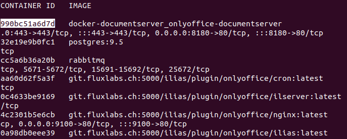
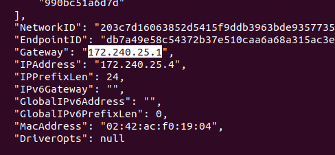
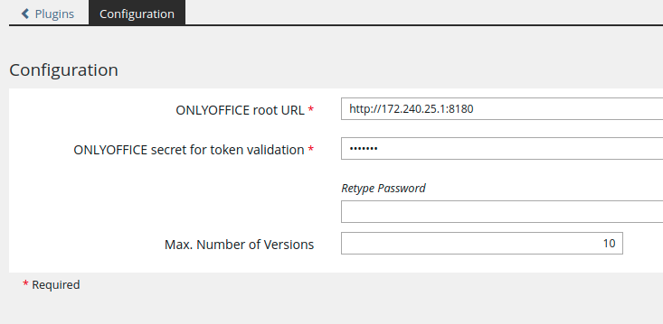

# Simple OnlyOffice Installation with Docker
This simple guide will guide developers on the installation process of OnlyOffice using Docker.

## Getting Started

### Requirements

* ILIAS 6.x / 7.x
* docker
* docker-compose

### Install OnlyOffice Docs
OnlyOffice Docs is used to edit documents from a separate server. First, we need to set OnlyOffice Docs up on a separate docker installation and 
later connect it to the plugin.

Clone the repository into a folder of your choice and start it up. Instructions were taken from [here](https://helpcenter.onlyoffice.com/installation/docs-community-docker-compose.aspx).
```bash
git clone https://github.com/ONLYOFFICE/Docker-DocumentServer
cd Docker-DocumentServer
sudo docker-compose up
```

> You may get an error saying "address already in use". This is likely because your host machine already utilises the port 80 for ilias.
> To fix this, edit the ports in docker-compose.yml of OnlyOffice Docs to 8180:80.
>
>

OnlyOffice Docs is now running on your docker server. Let's make it more secure in the next step.

### Security Configuration for OnlyOffice Docs
Open your OnlyOffice Docs' docker-compose.yml file.

In the environment section, uncomment all variables starting with "JWT".

Set a more secure password for the JWT_SECRET variable.


Save and exit the file.

### Install Ilias & the OnlyOffice-Plugin
Clone the OnlyOffice repository, switch directories and run the docker file in it:
```bash
git clone https://git.fluxlabs.ch/fluxlabs/ilias/plugins/RepositoryObjects/OnlyOffice.git OnlyOffice
cd /OnlyOffice/docker/
sudo docker-compose up
```

Once the docker is running, we need to clone the plugin first to get rid of all errors. From the previous steps, a new folder should have appeared called "ilias-www". Now do the following:

```bash
cd ilias-www/
sudo mkdir -p Customizing/global/plugins/Services/Repository/RepositoryObject
cd Customizing/global/plugins/Services/Repository/RepositoryObject
sudo git clone https://git.fluxlabs.ch/fluxlabs/ilias/plugins/RepositoryObjects/OnlyOffice.git OnlyOffice
```
> You may want to change the permissions of the "ilias-www" folder using chmod if you are planning on editing the files inside.

#### Obtaining the IP address of the docker containers

First, display all the docker containers.

```bash
docker container ls
```
Here you need to locate the container IDs of your two docker containers: OnlyOffice Docs and Ilias.

In the picture below, the container ID of OnlyOffice Docs is 990bc51a6d7d, because it's in front of an image ending with "onlyoffice-documentserver".

>

Similarly, the container ID of ilias is 0a98db0eee39, because it's in front of an image ending with "ilias:latest".

Now, do the following command, where CONTAINER_ID is one of your container IDs.

```bash
docker container inspect CONTAINER_ID
```

Here, locate the "Gateway" variable and copy it into a separate text document. Do this for both container IDs.

>

#### Adjust .htaccess

Now that we have the IPs, we need to ssh into the running ilias container and make a change to .htaccess. 

Copy the Container ID of Ilias (Not OnlyOffice Docs!) and insert it into the following command (Replace CONTAINER_ID with the ID you just copied):

```bash
docker exec -it CONTAINER_ID sh
```

Now we need to locate and adjust the .htaccess file. Once executing the previous command, you should be inside /var/www/html. Search for .htaccess using:

```bash
ls -all
```

You should be able to locate .htaccess inside your current directory.

Next, evaluate what needs to be inserted. We need to evaluate the hypothetical value of DOCS_HTTP_WITH_PORT, which is the OnlyOffice Docs gateway (previous picture) with the prefix "http://" and the host port appended to it e.g. http://x.x.x.x:8180

> The port may be different, consult the docker-compose.yml of OnlyOffice Docs, it's the highlighted value in the picture below.
>
> 

Now, edit the .htaccess file with a text editor of your choice.

Add the following line to the file (Where DOCS_HTTP_WITH_PORT is the previously evaluated http url. (Do not forget the "")

``` code
Header set Access-Control-Allow-Origin "DOCS_HTTP_WITH_PORT"
```

Once the editing is done, save your changes.


#### OnlyOffice-Plugin Configuration

Before entering the URL to access ilias, ensure that you do NOT use localhost or http://127.0.0.1/ to access your ilias docker installation, as you will not be able to communicate with OnlyOffice Docs. OnlyOffice Docs returns its callbacks to the actual docker ip, which is the product of the Ilias gateway with the prefix "http://" and the host port appended to it e.g. http://x.x.x.x:9100 (ILIAS_HTTP_WITH_PORT). The port should be 9100 granted you haven't changed anything in the docker-compose.yml of Ilias.

Access Ilias through DOCS_HTTP_WITH_PORT (e.g. http://x.x.x.x:9100).

Switch to the plugin administration and install OnlyOffice if you haven't already. Open the plugin configuration of OnlyOffice.



Insert DOCS_HTTP_WITH_PORT into the field "ONLYOFFICE root URL".

Enter the JWT-Secret which you specified in OnlyOffice's docker-compose.yml file

Save your changes.
