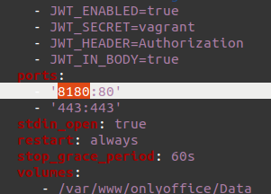

# Simple OnlyOffice Installation with Docker
This simple guide will guide developers on the installation process of OnlyOffice using Docker.

## Getting Started

### Requirements

* ILIAS 6.x / 7.x
* docker
* docker-compose

### Install OnlyOffice Docs
OnlyOffice Docs is used to edit documents from a separate server. First, we need to set OnlyOffice Docs up on a separate docker installation and 
later connect it to the plugin.

Clone the repository into a folder of your choice and start it up.
```bash
git clone https://github.com/ONLYOFFICE/Docker-DocumentServer
cd Docker-DocumentServer
sudo docker-compose up -d
```

> You may get an error saying "address already in use". This is likely because your host machine already utilises the port 80 for ilias.
> To fix this, edit the ports in docker-compose.yml of OnlyOffice Docs to 8180:80.
>
> 

Install the desired edition of OnlyOffice Docs on your server.
Note that the free community edition allows only 20 simultaneous connections.
Installation Guides can be found [here](https://helpcenter.onlyoffice.com/installation/docs-index.aspx)
We recommend using docker-compose for installation as specifications can easily be set within the .yml file.
We also recommend to set up HTTPS.

#### Security Configuration in OnlyOffice
(Note that this can only be done if you installed OnlyOffice docs using docker compose!)  
Open your OnlyOffice's docker-compose.yml file.
In onlyoffice-documentserver.environment section, uncomment all variables starting with "JWT".
Set a safer password in JWT_SECRET variable.

### Install OnlyOffice-Plugin
Start at your ILIAS root directory
```bash
mkdir -p Customizing/global/plugins/Services/Repository/RepositoryObject
cd Customizing/global/plugins/Services/Repository/RepositoryObject
git clone https://github.com/fluxapps/OnlyOffice.git OnlyOffice
```

Now you can install, update & activate the OnlyOffice plugin in your ILIAS installation.


#### Configure ILIAS
Start at your ILIAS root directory.
Open .htaccess file. Add the following line:
``` code
Header set Access-Control-Allow-Origin "https://onlyoffic_docs.example"
```
Where "onlyoffice_docs.example" is the name of the server where OnlyOffice Docs is installed.
If you did not set up https, use "http://" instead.

Next you must navigate to the plugin's configuration form.
Enter the root URL of your OnlyOffice Docs installation.
Enter the JWT-Secret which you specified in OnlyOffice's docker-compose.yml file.